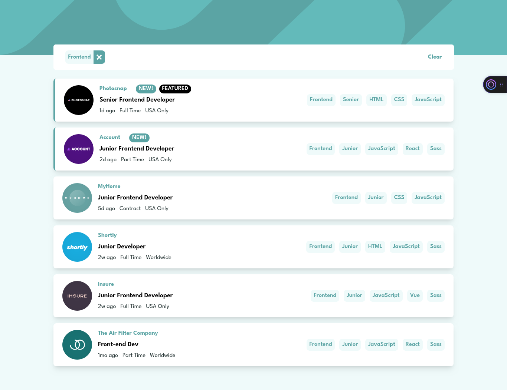

# Frontend Mentor - Job listings with filtering solution

This is a solution to the [Job listings with filtering challenge on Frontend Mentor](https://www.frontendmentor.io/challenges/job-listings-with-filtering-ivstIPCt). Frontend Mentor challenges help you improve your coding skills by building realistic projects.

## Table of contents

- [Overview](#overview)
  - [The challenge](#the-challenge)
  - [Screenshot](#screenshot)
  - [Links](#links)
- [My process](#my-process)
  - [Built with](#built-with)
  - [What I learned](#what-i-learned)
  - [Continued development](#continued-development)
  - [Useful resources](#useful-resources)
- [Author](#author)

## Overview

### The challenge

Users should be able to:

- View the optimal layout for the site depending on their device's screen size
- See hover states for all interactive elements on the page
- Filter job listings based on the categories

### Screenshot



### Links

- Solution URL: [GitHub](https://github.com/cosmo578/fm-static-job-listings)
- Live Site URL: [Vercel](https://raph-fm-static-job-listings.vercel.app)

## My process

### Built with

- Semantic HTML
- CSS custom properties
- Grid
- Flexbox
- Desktop-first workflow
- [React](https://reactjs.org/) - JS library
- [Tailwind CSS](https://tailwindcss.com/) - For styles

### What I learned

Use this section to recap over some of your major learnings while working through this project. Writing these out and providing code samples of areas you want to highlight is a great way to reinforce your own knowledge.

To see how you can add code snippets, see below:

First Time Using TailwindCSS V4 and Custom colors

```css
@import "tailwindcss";

@theme {
  --color-bodyBg: #effafa;
  --color-lightGray: #5ba4a4;
  --color-darkGray: #7b8e8e;
  --color-veryDarkGray: #2c3a3a;
}
```

Spreading the object keys to a component

```js
<main className="grid items-center gap-12 px-6 py-10 max-lg:pt-32 lg:gap-4 lg:px-36 lg:py-16">
  {filteredJobs?.map((job) => (
    <JobCard key={job.id} handleClick={handleClick} {...job} />
  ))}
</main>
```

### Continued development

Use this section to outline areas that you want to continue focusing on in future projects. These could be concepts you're still not completely comfortable with or techniques you found useful that you want to refine and perfect.

### Useful resources

- [TailwindCSS Docs](https://tailwindcss.com/docs/colors#customizing-your-colors) - This helped me in setting up tailwindcss v4 with vite and adding custom colors.

## Author

- Website - [Developer Raphael](https://ralph-portfolio-v2.vercel.app)
- Frontend Mentor - [@yourusername](https://www.frontendmentor.io/profile/yourusername)
- Twitter - [Developer Raphael](https://www.twitter.com/dev_ralph_)
